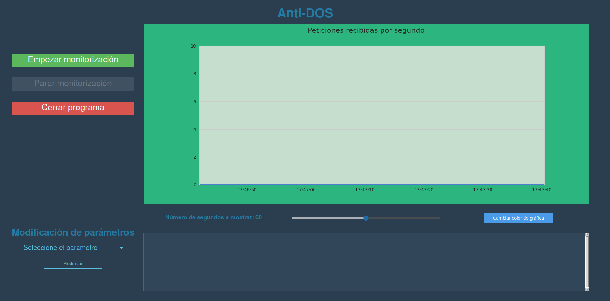

# Anti-DOS

Anti-DOS es una herramienta para mejorar la resistencia de los servidores web contra ataques de denegación de servicio (DoS), tanto a través de una interfaz de línea de comandos como de una interfaz gráfica de usuario (GUI).


## Instalación

Para instalar la herramienta, podemos seguir estos pasos
1. Primero nos clonaremos el repositorio:

    ```bash
    git clone https://github.com/M3RINOOOOO/Anti-DoS-attack.git
   ```

2. Entramos a la carpeta del proyecto e instalamos las dependencias

    ```bash
   cd Anti-DoS-attack && pip3 install -r requirements.txt
   ```
3. Ahora le damos permisos de ejecución a los archivos necesarios
    ```bash
    chmod +x AntiDoSCLI.py AntiDoSGUI.py setup.sh
   ```
4. Ya estás listo para ejecutar la herramienta para mejorar la seguridad de tu servidor!


## Uso

La herramienta Anti-DOS se puede utilizar tanto desde la línea de comandos como a través de su interfaz gráfica de usuario.

### Interfaz de línea de comandos (CLI)

En el repositorio recién clonado hay un script `AntiDoSCLI.py` que proporciona una interfaz para manejar la aplicación desde la consola.

Podemos ejecutar este script de dos formas:

- **Forma interactiva**. Para ejecutar la CLI de forma interactiva, podemos hacerlo de la siguiente forma:
    ```bash
    ./AntiDoSCLI.py --interactive
    ```
  De esta forma, el script nos pedirá, de manera interactiva, los datos necesarios para montar la aplicación (Servidor a usar, rutas de los logs, archivo de configuración, etc.)

    Para más información acerca del almacenamiento y modificación de variables globales, consulta [este apartado](#almacenamiento-y-modificación-de-las-variables-globales).
- **Tomando argumentos**. También podemos pasar las variables necesarias mediante argumentos. Los argumentos disponibles de la herramienta se pueden consultar ejecutando:
    ```./AntiDoSCLI.py --help```:

    ```txt
      --server SERVER       Servidor en uso (Apache/Nginx)
      --ban-path BAN_PATH   Ruta de archivo de bans
      --log-path LOG_PATH   Ruta de archivo de logs
      --config-path CONFIG_PATH
                            Ruta de archivo de configuración del servidor
      --telegram-user TELEGRAM_USER
                            Usuario de Telegram
      --database-file DATABASE_FILE
                            Archivo de base de datos
  ```
  Si no se pasa alguno de esos argumentos, el valor para la respectiva variable se intentará tomar del archivo `.env`. En caso de que alguna variable necesaria no se haya proporcionado, el programa mostrará un mensaje de error y se cerrará. Para más información acerca del almacenamiento y modificación de variables globales, consulta [este apartado](#almacenamiento-y-modificación-de-las-variables-globales).

    A modo de ejemplo, si queremos ejecutar el programa proporcionando: servidor a usar, archivo de baneos, archivo de configuración y archivo de logs (en el ejemplo, para Apache), podríamos ejeuctar:

    ```bash
    ./AntiDoSCLI.py --server apache --ban-path /var/www/html/.htaccess --config-path /etc/apache2/apache2.conf --log-path /var/log/apache2/access.log
  ```

  
### Interfaz Gráfica (GUI)

El formato más amigable de esta aplicación es usando el script `AntiDoSGUI.py`. Su uso es más sencillo que su versión de línea de comandos. Para iniciarlo, basta con ejecutar el comando:

```bash
./AntiDoSGUI.py
```

Si es la primera que ejecutas la herramienta, o faltan algunas de las variables necesarias para poder ejecutarse, la aplicación que guiará por una serie de pantallas para introducir los datos necesarios.

Una vez introducidos los datos, se te llevará a esta pantalla principal:



Desde aquí podemos:

- Ver una gráfica con las peticiones recibidas por segundo en tiempo real
- Empezar/detener la monitorización
- Cambiar el color de la gráfica
- Cambiar el intervalo de tiempo a representar en la gráfica
- Cambiar las variables que necesitemos
- Ver qué IPs han sido baneadas/desbaneadas

## Conexión por Telegram

Hemos configurado la aplicación para que,si se detecta un ataque DOS sobre tu página web, nuestro Bot de Telegram te envía una alerta.

Para poder activar esta funcionalidad, necesitas tener una cuenta de Telegram e introducir tu nombre de usuario cuando la aplicación lo pida.

Una vez hecho eso, tendrás que iniciar una conversación con el bot: `NOMBRE DEL BOT`. Basta con seguir las instrucciones que el mismo te indique.

## Almacenamiento y modificación de las variables globales

Anti-DOS trabaja principalmente con estas variables:

- **SERVER**. Indica el servidor que se va a usar. En la versión actual, sólo se aceptan APACHE y NGINX
- **BAN_PATH**. Indica la ruta al archivo que usa el servidor para realizar los baneos a la IPs que estén atacando el servicio
- **CONFIG_PATH**. Indica la ruta al archivo de configuración del servidor
- **LOG_PATH**. Indica la ruta al archivo de logs de la web (access.log)
- **DATABASE_FILE**. Para implementar persistencia en el programa, este trabaja con **SQLite**. Por defecto, se crea un archivo llamado `ip_bans.db`, pero puede modificarse.
- **TELEGRAM_USER**. Si has seguido las instrucciones de [Conexión con Telegram](#conexión-por-telegram) y has configurado tu nombre de usuario, se almacenará en esta variable.

Cuando se modifican algunas de estas variables **desde la aplicación**, se ejecuta el script `setup.sh`. Lo que hace este script es asignar los permisos correspondientes a los archivos que lo necesiten.

> [!WARNING]
> Si vas a modificar alguna de estas variables del `.env` modificando el archivo en sí, asegúrate de ejecutar el script `setup.sh`.

Además, en el archivo `config.py` se encuentran definidas, entre otras, dos variables globales:

```python
MAX_REQUESTS_PER_SEG = 40
TIEMPO_BANEO = 3
```

- **MAX_REQUESTS_PER_SEG**. Indica el número máximo de peticiones que se va a permitir que una IP realice a nuestro servidor
- **TIEMPO_BANEO**. Es el tiempo base, en segundos, que una dirección IP va a estar baneada. Este tiempo va aumentando exponencialmente, de forma que, si su valor es 3, primero estará baneado 3 segundos. Si vuelve a realizar más peticiones de las debidas, estará baneado 6 segundos, después 12, 24, etc.

Estas variables son totalmente personalizables y ajustables a cada situación. 

## Principal contenido del repositorio

- **AntiDOSWeb.py**: Este módulo contiene la implementación de funcionalidades para prevenir ataques DoS en una aplicación web.
- **config.py**: Aquí se almacena la configuración de la aplicación, como URL, rutas de archivos y otros parámetros importantes.
- **AntiDoSCLI.py**: Archivo que proporciona una interfaz de línea de comandos para ejecutar el programa Anti-DOS
- **AntiDoSGUI.py**: Archivo que implementa la interfaz gráfica de usuario (GUI) para ejecutar el programa Anti-DOS de manera más visual e interactiva.
- **GraphPage.py**: Contiene la implementación de una página de gráficos para mostrar datos relacionados con ataques DoS.
- **requirements.txt**: Archivo que enumera todas las dependencias y bibliotecas de Python necesarias para ejecutar la aplicación.
- **setup.sh**: Script de configuración para configurar la aplicación.


## Contribución

Las contribuciones son bienvenidas! Si deseas mejorar esta herramienta, abre un issue o crea un pull request.

